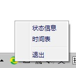
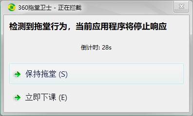
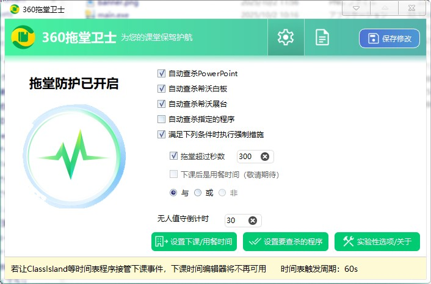

# 360 拖堂卫士

《360拖堂卫士》是一款防拖堂软件，会在下课时间弹窗警告，必要时强制关闭PPT、希沃白板等教学软件，保障学生充足的下课休息时间。

**目前360拖堂卫士仅支持Win10及以上系统**

## 启动

- **start.exe**：用于启动主程序（main.exe）不提供任何界面，但是会创建一个托盘图标。若到达指定下课时间，自动启动main.exe。**若让ClassIsland启动main.exe，请勿重复启动start.exe。**

- **main.exe**：程序运行时会立即创建一个窗口覆盖整个屏幕，要求老师选择拖堂或下课，在做出选择前，窗口不能被关闭。

- **mainui.exe**：图形化设置界面，可以快速设置下课时间，提醒文本等。

**通常情况下，需要先在mainui.exe中配置好下课时间，每次开机时启动start.exe在后台运行**

## 设置

打开mainui.exe，进行设置。顶栏两个图标分别是“常规设置”和“文本设置”两个选项卡，在完成设置后，需要点击顶部“保存修改”才能生效。

以下是常见设置项解释：

### 无人值守倒计时

为了防止户外课程下课时教室内没人，设置无人值守倒计时后若指定时间内没有任何人响应，自动结束程序，等待下一次下课（也就是启动main.exe时的“倒计时”）

### 满足下列条件时执行强制措施 - 拖堂超过秒数

在下课时，弹出的对话框有“拖堂”和“下课”两个选项，为了防止老师点击“拖堂”后无限制继续授课，超过“强制措施”设定时间后自动强制关闭PPT且没有任何提示。该功能在触发无人值守模式后依然有效。若不需要此功能，关闭此功能前的复选框即可。

### 实验性选项

这些功能出发后可能会有难以估量的后果，因此不可随意修改。

**不要随意修改JSON文件！**

## 开发

使用PyQt6制作，以MIT协议发布

